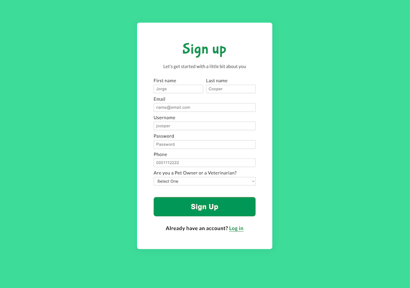
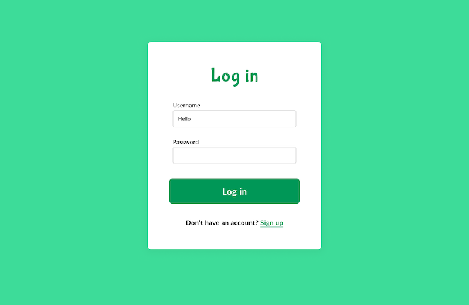
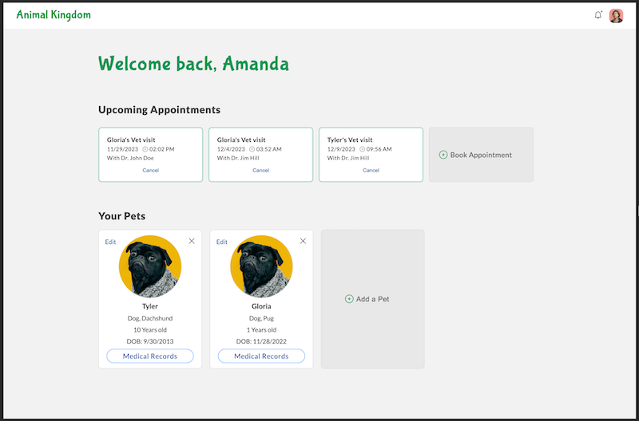
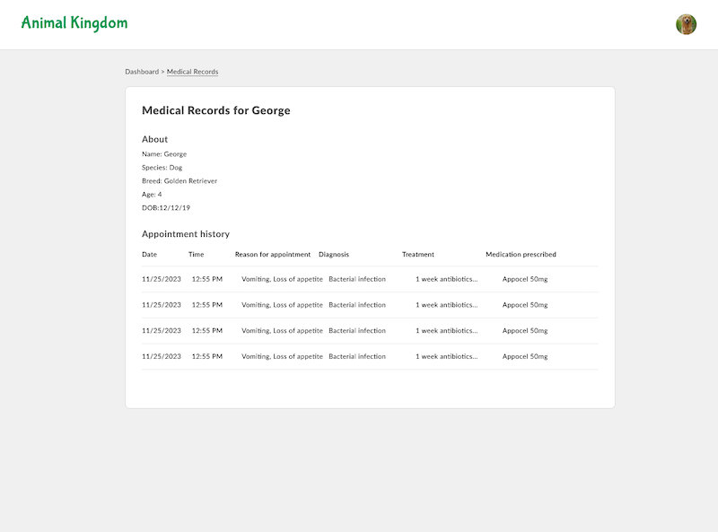

[contributors-shield]: https://img.shields.io/badge/contributors-_3-green?style=for-the-badge
[contributors-url]: https://github.com/smackeem/Animal_Kingdom_Project_2/graphs/contributors
[pulse-shield]: https://img.shields.io/badge/pulse-_%E2%9C%94-green?style=for-the-badge
[pulse-url]: https://github.com/smackeem/Animal_Kingdom_Project_2/pulse/monthly

 

    
  [![Pulse][pulse-shield]][pulse-url]
  [![Contributors][contributors-shield]][contributors-url]

  
  
  

<!-- TABLE OF CONTENTS -->

    
Table of Contents

    <ul>
        <li><a href="#about-the-project">About The Project</a></li>
        <li><a href="#screenshots-and-wireframe">Screenshots and Wireframe</a></li>
        <li><a href="#technologies-used">Technologies Used</a></li>
        <li><a href="#getting-started">Getting Started</a></li>
        <li><a href="#key-features">Key Features</a></li>
        <li><a href="#next-steps-and-future-enhancements">Next Steps and Future Enhancements</a></li>
        <li><a href="#contact">Contact</a></li>
    </ul>

## About the Project
Animal Kingdom is a comprehensive and user-friendly web application designed to streamline and enhance the pet care experience for both pet owners and veterinarians. With a focus on providing a seamless and organized approach to managing pet health, appointments, and communication. Animal Kingdom is not just an application; it's a companion on your pet care journey, designed to make the process of managing your pet's health as enjoyable and stress-free as possible.

## Screenshots and Wireframe
https://tinyurl.com/5cy6dvvc

## Technologies Used

## Getting Started
🚀 Explore our Animal Kingdom: https://animalkingdom-67bef32faf2a.herokuapp.com/

* View our Trello Board: https://tinyurl.com/479yud33

* View the ERD for each Data Entity: https://tinyurl.com/5n8mtv5b

## Key Features
1. User-Friendly Pet Profiles:
   Pet owners can create profiles for their furry friends, including essential details like species and breed.
2. Appointment Scheduling:
   Effortlessly schedule and manage veterinary appointments for pets. 
3. Medical Records Management:
   Keep track of your pet's health with a centralized medical records system. Easily update and access information on diagnoses, treatments, and medications.
   
## Next Steps and Future Enhancements
1. Digital prescription issuance and management.
2. Facilitate communication between pet owners and veterinarians through a secure messaging system. Discuss treatment plans, ask questions, and receive timely updates on your pet's progress.
3. Real-Time Notifications for upcoming appointments, medication reminders, and important updates from your veterinarian.
4. Educational content about pet health and wellness.
5. Feature for pet owners to upload and share pet photos or milestones.
6. Online payment system for clinic services.
7. Mobile app version for convenient access on the go.
8. Pet owners can connect with a community of experienced veterinarians specializing in various fields to choose the right professional for your pet's specific needs.

## Contact
Ackeem Smith  

Amanda Mitzian  

Andrew Brown  

(<a href="#readme-top">back to top</a>)

